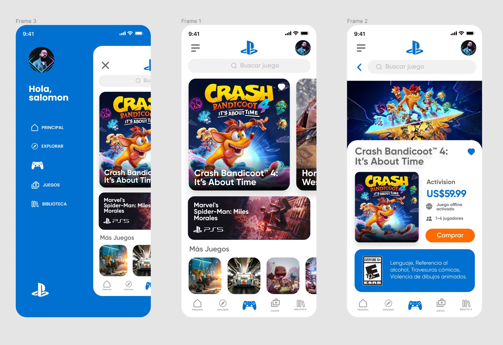
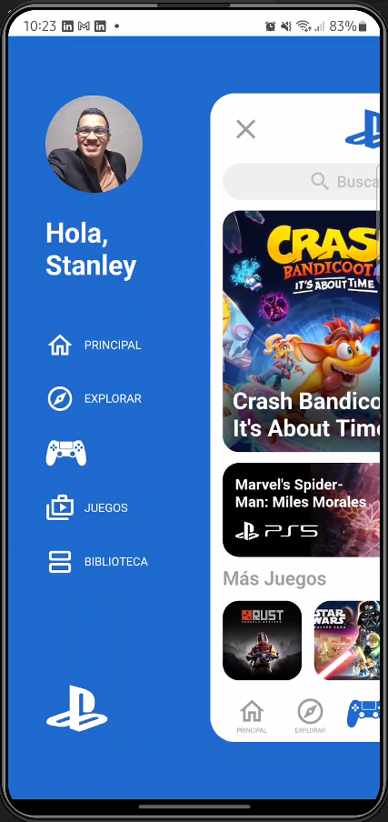
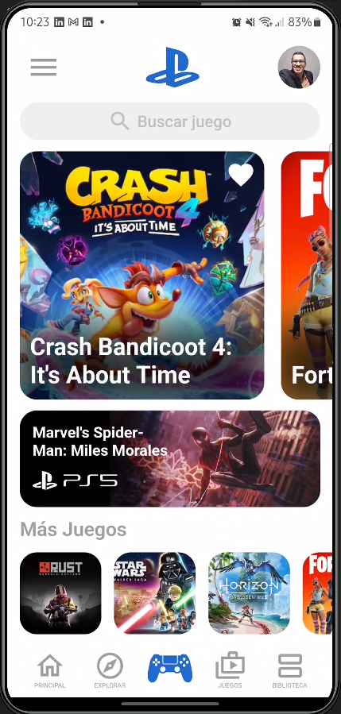
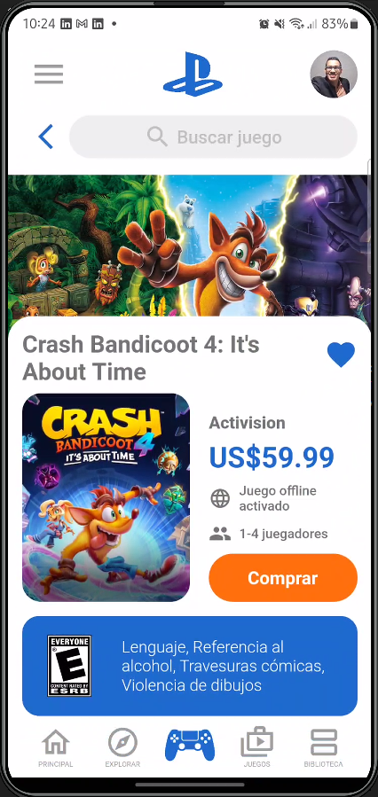

## FLUTTER GAME STORE APP
___
## Inspiración

___
## Aplicación Flutter
### Descripción

Aplicacion de tienda de videojuegos en linea de la franquisia de Play Station.

Alguno detalles de la aplicación:
- Diseño moderno
- Hidden drawer menu
- Animaciones (TweenAnimation, AnimatedWidget, AnimationController, etc)
- Sin uso de packages

## Capturas de pantalla
<TABLE BORDER>
    <TR>
        <TH style="text-align:center">Menu principal</TH>
        <TH style="text-align:center">Busqueda de juegos</TH>
        <TH style="text-align:center">Detalles del juego</TH>
    </TR>
	<TR>
		<TD></TD> 
        <TD></TD> 
        <TD></TD>
	</TR>
</TABLE>

## Demo en dispositivo fisico

